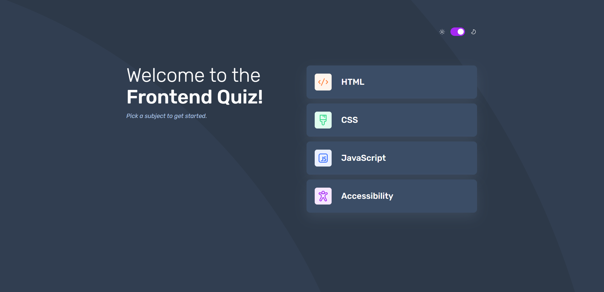

# Frontend Mentor - Frontend quiz app solution

This is a solution to the [Frontend quiz app challenge on Frontend Mentor](https://www.frontendmentor.io/challenges/frontend-quiz-app-BE7xkzXQnU). Frontend Mentor challenges help you improve your coding skills by building realistic projects.

## Table of contents

- [Overview](#overview)
  - [The challenge](#the-challenge)
  - [Screenshot](#screenshot)
  - [Links](#links)
- [My process](#my-process)
  - [Built with](#built-with)
  - [What I learned](#what-i-learned)
  - [Continued development](#continued-development)
  - [Useful resources](#useful-resources)
- [Author](#author)

## Overview

### The challenge

Users should be able to:

- Select a quiz subject
- Select a single answer from each question from a choice of four
- See an error message when trying to submit an answer without making a selection
- See if they have made a correct or incorrect choice when they submit an answer
- Move on to the next question after seeing the question result
- See a completed state with the score after the final question
- Play again to choose another subject
- View the optimal layout for the interface depending on their device's screen size
- See hover and focus states for all interactive elements on the page
- Navigate the entire app only using their keyboard
- **Bonus**: Change the app's theme between light and dark

### Screenshot



### Links

- Solution URL: [Add solution URL here](https://your-solution-url.com)
- Live Site URL: [Add live site URL here](https://your-live-site-url.com)

## My process

### Built with

- Semantic HTML5 markup
- CSS custom properties
- Flexbox
- CSS Grid
- Mobile-first workflow
- JavaScript

### What I learned

How to create a simple progress bar and update its progress via JavaScript:

```css
.progress-bar {
  position: relative;
  height: 16px;
  border: none;
  border-radius: 999px;
  padding: 4px;
  background-color: light-dark(var(--color-white), var(--color-blue-850));
  --progress: 0px;
}

.progress-bar::before {
  position: absolute;
  content: "";
  background-color: var(--color-purple-600);
  border: none;
  border-radius: 104px;
  width: var(--progress);
  height: 8px;
}
```

```js
const progress = ((questionIndex + 1) / subject.questions.length) * 100;
progressBar.style.setProperty("--progress", progress.toString() + "%");
```

To remove focus from a button after it is clicked:

```js
playAgainBtn.addEventListener("click", function () {
  this.blur();
  quizEndContainer.classList.remove(showContainerClassName);
  menuContainer.classList.add(showContainerClassName);
  resetValues();
});
```

### Continued development

Analyze existing websites and reverse-engineer how they implemented the ff:

- responsiveness
- light/dark theme
- organize CSS styles

Work on challenges with:

- forms, validation
- various layouts
- DOM manipulation

Learn the basics of:

- accessibiity
- animation

### Useful resources

- [MDN](https://developer.mozilla.org/en-US/docs/Web) - This helped me with some syntax.

## Author

- Website - [jezzydev](https://github.com/jezzydev)
- Frontend Mentor - [@jezzydev](https://www.frontendmentor.io/profile/jezzydev)
